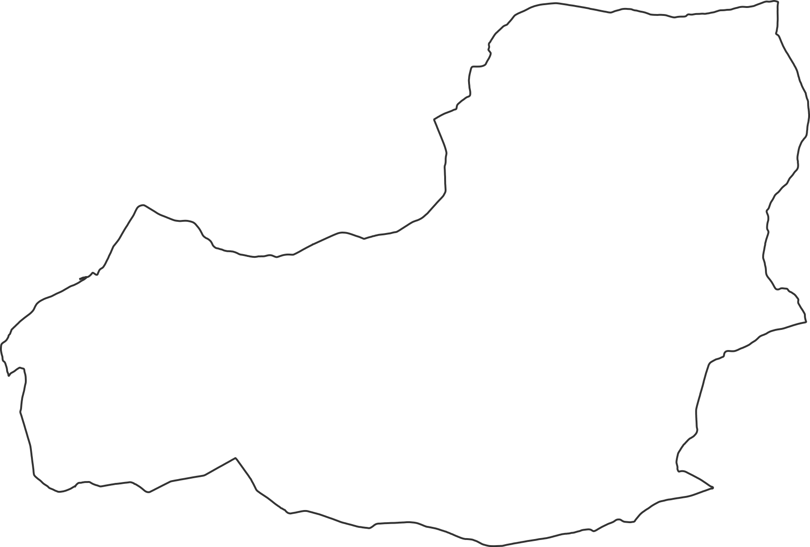
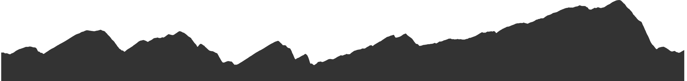

## GPX to SVG

This Javascript module converts a GPX file to a SVG track (path) and a SVG elevation profile

Track:

Elevation: 

## How to install

yarn

## how to run

yarn convert --gpx=sample_gpx/workout.gpx